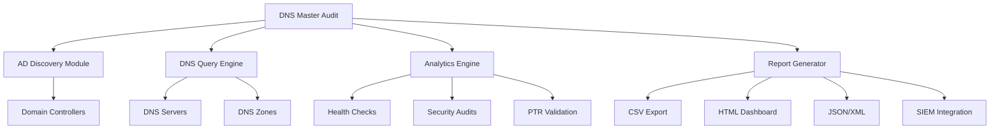
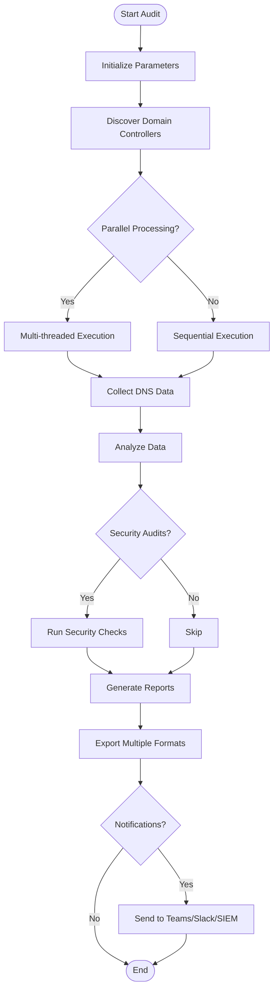
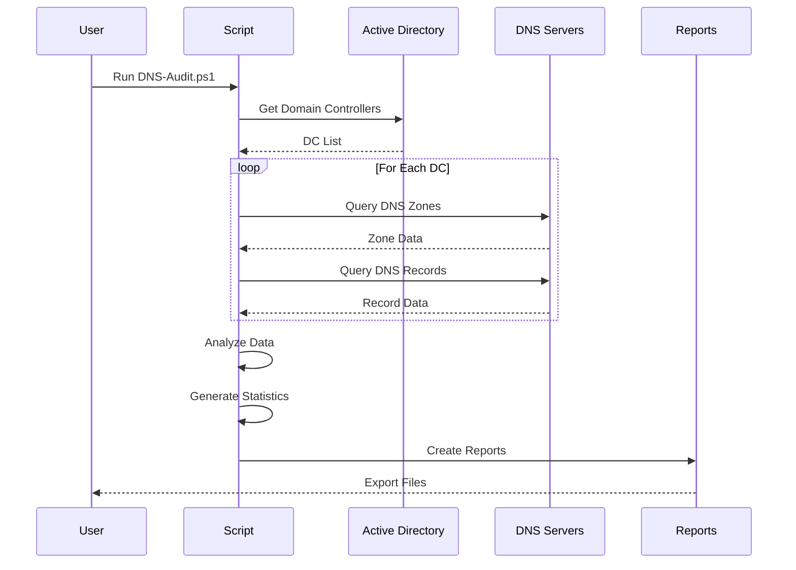
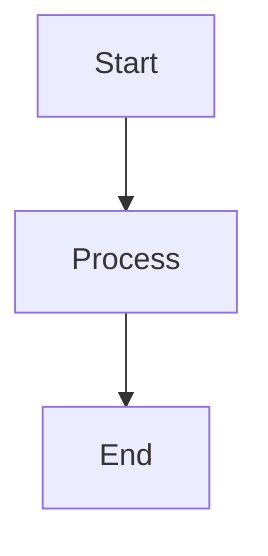

# Visual Documentation Guide

> **Recommendations for creating visual assets** to enhance DNS Master Audit documentation.

## Overview

Visual documentation significantly improves understanding and engagement. This guide provides recommendations for diagrams, screenshots, and other visual assets.

## Priority Visual Assets

### 1. Architecture Diagram (High Priority)

**Purpose**: Show system architecture and component relationships

**Recommended Tool**: Draw.io, Lucidchart, or Mermaid

**Components to Include:**
```
┌─────────────────────────────────────────────────────────────┐
│                    DNS Master Audit                         │
│                    PowerShell Script                        │
└─────────────────────────────────────────────────────────────┘
                           │
    ┌──────────────────────┼──────────────────────┐
    │                      │                      │
    ▼                      ▼                      ▼
┌─────────┐          ┌─────────┐          ┌─────────┐
│   AD    │          │  DNS    │          │ Output  │
│ Module  │          │ Module  │          │ Engine  │
└─────────┘          └─────────┘          └─────────┘
    │                      │                      │
    ▼                      ▼                      ▼
┌─────────┐          ┌─────────┐          ┌─────────┐
│Domain   │          │DNS      │          │CSV/JSON │
│Control- │          │Servers  │          │HTML/PDF │
│lers     │          │& Zones  │          │Reports  │
└─────────┘          └─────────┘          └─────────┘
```

**Mermaid Code** (for GitHub-native diagrams):


### 2. Workflow Diagram (High Priority)

**Purpose**: Show audit execution flow

**Mermaid Code**:


### 3. Feature Overview Diagram (Medium Priority)

**Purpose**: Visual feature map

```
                    DNS Master Audit
                          │
    ┌─────────────────────┼─────────────────────┐
    │                     │                     │
    ▼                     ▼                     ▼
┌─────────┐         ┌─────────┐         ┌─────────┐
│  Core   │         │Advanced │         │Enterprise│
│Features │         │Analytics│         │Integration│
└─────────┘         └─────────┘         └─────────┘
    │                     │                     │
    ├─Inventory           ├─Stale Records       ├─Teams
    ├─Health Check        ├─Duplicate IPs       ├─Slack
    ├─Record Export       ├─PTR Validation      ├─SIEM
    ├─Zone Analysis       ├─Security Audits     ├─Webhooks
    └─Complete Audit      └─CIS Compliance      └─Email
```

### 4. Screenshots (High Priority)

**Required Screenshots:**

1. **HTML Dashboard**
   - Full dashboard view
   - Executive summary cards
   - Interactive charts
   - Data tables

2. **Console Output**
   - Running audit with progress
   - Summary statistics
   - Parallel processing indicators

3. **Reports**
   - CSV export example
   - JSON structure sample
   - PDF report sample

4. **Configuration**
   - Config file example
   - Parameter examples

**Screenshot Guidelines:**
- Resolution: 1920x1080 or 1280x720
- Format: PNG with transparency or JPG
- Annotations: Use arrows/circles for key features
- File size: Optimize to < 500KB
- Dark theme: Consider providing both light/dark versions

### 5. Data Flow Diagram (Medium Priority)

**Purpose**: Show data collection and processing

**Mermaid Code**:


### 6. Use Case Diagram (Low Priority)

**Purpose**: Show different user roles and their interactions

```
             ┌─────────────────┐
             │  DNS Master     │
             │     Audit       │
             └─────────────────┘
                     │
    ┌────────────────┼────────────────┐
    │                │                │
┌─────────┐    ┌─────────┐    ┌─────────┐
│  DNS    │    │Security │    │  IT     │
│  Admin  │    │  Team   │    │  Ops    │
└─────────┘    └─────────┘    └─────────┘
    │                │                │
    ├─Daily Health   ├─CIS Audits    ├─Automation
    ├─Maintenance    ├─DNSSEC Check  ├─Scheduling
    └─PTR Mgmt       └─Compliance    └─Monitoring
```

## Visual Asset Organization

### Directory Structure
```
docs/
├── images/
│   ├── architecture/
│   │   ├── system-architecture.png
│   │   ├── component-diagram.png
│   │   └── data-flow.png
│   ├── screenshots/
│   │   ├── dashboard-main.png
│   │   ├── console-output.png
│   │   ├── reports-example.png
│   │   └── configuration.png
│   ├── diagrams/
│   │   ├── workflow.png
│   │   ├── use-cases.png
│   │   └── feature-map.png
│   └── logos/
│       ├── logo.png
│       ├── logo-dark.png
│       └── social-preview.png
└── README.md
```

## Creating Diagrams

### Recommended Tools

1. **Draw.io (diagrams.net)** - Free, web-based
   - Best for: Architecture diagrams, flowcharts
   - Export: PNG, SVG, PDF
   - https://app.diagrams.net/

2. **Mermaid** - GitHub-native, markdown-based
   - Best for: Simple flowcharts, sequence diagrams
   - Renders directly in GitHub README
   - https://mermaid.js.org/

3. **Lucidchart** - Commercial, professional
   - Best for: Complex enterprise diagrams
   - Export: PNG, PDF, SVG
   - https://www.lucidchart.com/

4. **PlantUML** - Text-based, programmers' choice
   - Best for: Version-controlled diagrams
   - Export: PNG, SVG
   - https://plantuml.com/

5. **Excalidraw** - Hand-drawn style, free
   - Best for: Informal sketches, presentations
   - Export: PNG, SVG
   - https://excalidraw.com/

### Style Guidelines

**Color Palette:**
- Primary: #0078D4 (Microsoft Blue)
- Secondary: #107C10 (Success Green)
- Warning: #FF8C00 (Orange)
- Error: #D13438 (Red)
- Neutral: #605E5C (Gray)
- Background: #FFFFFF (White) or #1E1E1E (Dark)

**Typography:**
- Headings: Segoe UI Bold or Arial Bold
- Body: Segoe UI or Arial
- Code: Consolas or Courier New

**Diagram Standards:**
- Consistent icon sizes
- Aligned elements
- Clear labels
- Directional arrows
- Legend when needed

## Logo Design (Optional)

**If creating a logo:**

**Elements to consider:**
- DNS server icon (globe with circuit lines)
- Magnifying glass (audit/inspection)
- Shield (security)
- PowerShell icon reference
- Windows Server branding (if allowed)

**Specifications:**
- Square format: 512x512px
- Transparent background PNG
- SVG version for scalability
- Variants: Color, monochrome, dark mode

**Logo variants needed:**
- `logo.png` - Full color (512x512px)
- `logo-dark.png` - Dark mode version
- `logo-small.png` - Favicon size (32x32px, 64x64px)
- `logo.svg` - Vector version

## Social Media Preview

**GitHub Social Preview** (1280x640px):

**Content:**
- Repository name: "DNS Master Audit"
- Tagline: "Enterprise DNS Auditing & Management"
- Key features: 3-4 bullet points
- Technology badges: PowerShell, Windows Server
- Background: Professional gradient or pattern

**Design Tools:**
- Canva (free templates)
- Figma (professional design)
- Adobe Express (quick graphics)

**Template:**
```
┌────────────────────────────────────────────────────┐
│                                                    │
│        🔍 DNS Master Audit                        │
│        Enterprise DNS Auditing & Management        │
│                                                    │
│  ✅ Parallel Processing  ✅ Security Audits       │
│  ✅ Interactive Dashboards  ✅ SIEM Integration   │
│                                                    │
│  [PowerShell] [Windows Server] [Active Directory] │
│                                                    │
└────────────────────────────────────────────────────┘
```

## Animated GIFs (Advanced)

**Use cases for GIFs:**
1. Quick start demo (30 seconds)
2. Dashboard navigation (15 seconds)
3. Feature highlights (20 seconds each)

**Tools:**
- ScreenToGif (Windows, free)
- LICEcap (cross-platform, free)
- Kap (macOS, free)

**Guidelines:**
- Max duration: 30 seconds
- Max file size: 5MB
- Frame rate: 10-15 fps
- Resolution: 1280x720
- Optimize with Gifsicle or similar

## Embedding in Documentation

### Markdown Syntax

**Images:**
```markdown

```

**Linked Images:**
```markdown
[](docs/images/screenshots/dashboard.png)
```

**Mermaid Diagrams:**
````markdown

````

**HTML (for sizing):**
```html

```

## Next Steps

1. **Immediate** (Week 1):
   - Create basic architecture diagram
   - Take 3-5 essential screenshots
   - Add to README.md

2. **Short-term** (Month 1):
   - Create all recommended diagrams
   - Design social preview image
   - Add screenshots to all guides

3. **Long-term** (Quarter 1):
   - Create animated GIFs
   - Design professional logo
   - Create video tutorial

## Resources

**Stock Images:**
- Unsplash: https://unsplash.com
- Pexels: https://pexels.com
- Icons8: https://icons8.com

**Icon Libraries:**
- Font Awesome: https://fontawesome.com
- Material Icons: https://fonts.google.com/icons
- PowerShell Icons: https://github.com/PowerShell/PowerShell

**Color Tools:**
- Coolors: https://coolors.co
- Adobe Color: https://color.adobe.com
- Material Design Colors: https://materialui.co/colors

---

**Last Updated**: October 26, 2025  
**Maintained By**: Adrian Johnson (adrian207@gmail.com)
