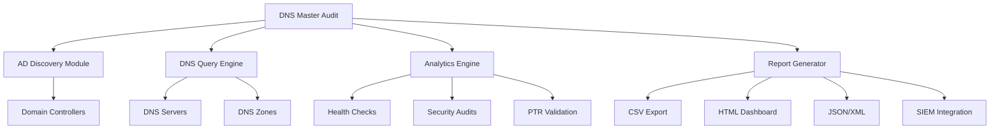

# Architecture Diagrams

System architecture and component diagrams for DNS Master Audit.

## Diagrams Needed

### 1. System Architecture (Priority: High)
**Filename**: `system-architecture.png` or `system-architecture.svg`

**Should show**:
- DNS Master Audit core engine
- Active Directory module
- DNS query engine
- Analytics engine
- Report generator
- External integrations (Teams, Slack, SIEM)

**Mermaid code available** in `.github/VISUAL-DOCUMENTATION-GUIDE.md`

### 2. Component Diagram (Priority: Medium)
**Filename**: `component-diagram.png`

**Should show**:
- Internal modules and their relationships
- Data flow between components
- External dependencies (PowerShell modules)

### 3. Data Flow Diagram (Priority: Medium)
**Filename**: `data-flow.png`

**Should show**:
- User input → Script → Active Directory → DNS Servers → Reports
- Sequence of operations
- Data transformations

## Creating Diagrams

**Recommended approach**:

1. Use Mermaid for GitHub-native rendering (see example below)
2. Export to PNG/SVG using Draw.io or similar
3. Place file in this directory
4. Update main README.md to embed the diagram

**Example Mermaid diagram** (copy to your markdown):

## Specifications

- **Format**: PNG or SVG (prefer SVG)
- **Resolution**: Minimum 1280x720
- **Background**: Transparent or white
- **Style**: Professional, clean lines
- **Colors**: Follow design guidelines (see main images README)

## Status

- [ ] System architecture diagram
- [ ] Component diagram
- [ ] Data flow diagram
