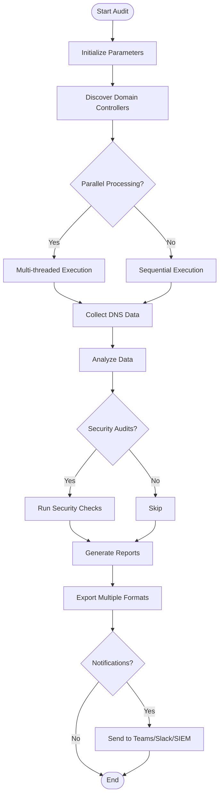
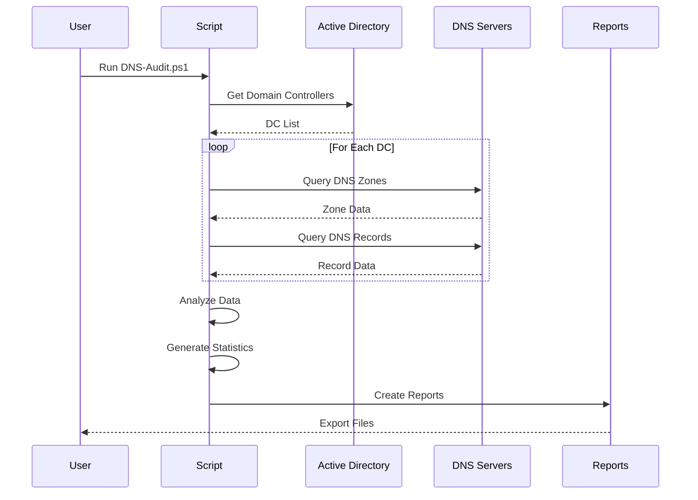

# Workflow and Process Diagrams

Workflow diagrams, feature maps, and process flows for DNS Master Audit.

## Diagrams Needed

### High Priority

1. **Complete Audit Workflow**
   - Filename: `workflow-complete-audit.png`
   - Shows: Start → Discovery → Collection → Analysis → Export → Notify → End
   - Type: Flowchart
   - Mermaid code available in `.github/VISUAL-DOCUMENTATION-GUIDE.md`

2. **Feature Overview Map**
   - Filename: `feature-map.png`
   - Shows: Core features, advanced analytics, enterprise integrations
   - Type: Mind map or hierarchical diagram

### Medium Priority

3. **Parallel Processing Flow**
   - Filename: `parallel-processing-flow.png`
   - Shows: How multi-threading works, runspace management
   - Type: Sequence diagram or flowchart

4. **Security Audit Process**
   - Filename: `security-audit-process.png`
   - Shows: CIS checks, DNSSEC validation, zone transfer audits
   - Type: Flowchart

5. **PTR Validation Workflow**
   - Filename: `ptr-validation-workflow.png`
   - Shows: Detection → Analysis → Auto-fix process
   - Type: Flowchart

### Low Priority

6. **Use Case Diagram**
   - Filename: `use-cases.png`
   - Shows: Different user roles and their interactions
   - Type: UML use case diagram

7. **Deployment Architecture**
   - Filename: `deployment-architecture.png`
   - Shows: Where script runs, network topology, dependencies
   - Type: Deployment diagram

## Example Mermaid Diagrams

### Workflow Diagram

### Sequence Diagram

## Creating Diagrams

**Tools:**
1. **Mermaid** - Paste code above into GitHub markdown
2. **Draw.io** - https://app.diagrams.net/
3. **Lucidchart** - https://www.lucidchart.com/
4. **Excalidraw** - https://excalidraw.com/

**Process:**
1. Start with Mermaid code (renders in GitHub)
2. For complex diagrams, export from Draw.io or Lucidchart
3. Save as PNG or SVG in this directory
4. Optimize file size before committing

## Specifications

- **Format**: PNG or SVG (prefer SVG for flowcharts)
- **Resolution**: 1280x720 minimum
- **Background**: Transparent or white
- **Style**: Clean, professional, easy to follow
- **Colors**: Use design palette (see main images README)

## Status

- [ ] workflow-complete-audit.png
- [ ] feature-map.png
- [ ] parallel-processing-flow.png
- [ ] security-audit-process.png
- [ ] ptr-validation-workflow.png
- [ ] use-cases.png
- [ ] deployment-architecture.png
